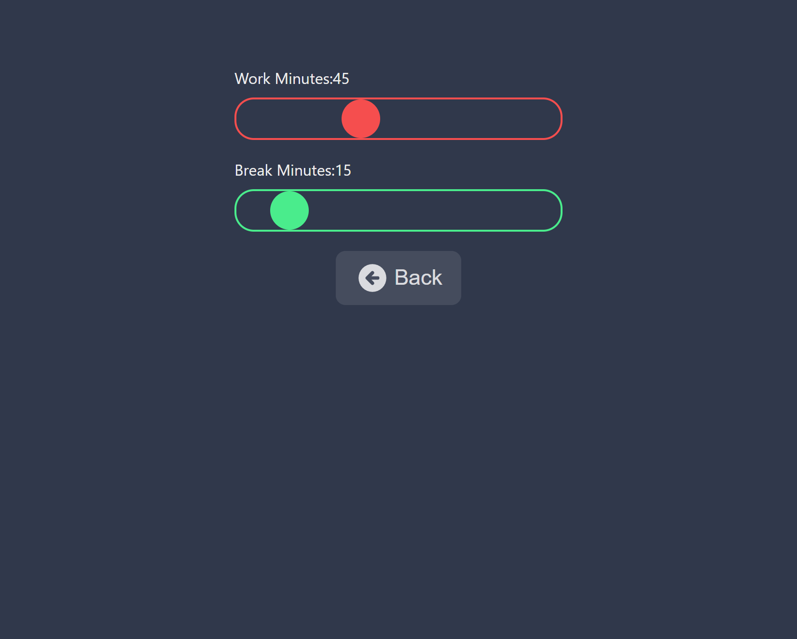

# Pomodoro Timer App

This is the famous Pomodoro timer.


## Tech Stack

**Client:** React

**Server:** Not Applicable


## Features

- Change work and break minutes


## Installation

Install my-project with npm

```bash
  create-react-app pomodoro_timer
  cd pomodoro_timer
  

```
    
## License

[MIT](https://choosealicense.com/licenses/mit/)


## Run Locally

Clone the project

```bash
  git clone https://github.com/Dil2010/Pomodoro_Timer_App
```

Go to the project directory

```bash
  cd my-project
```

Install dependencies

```bash
  npm install
```


## Screenshots

Pomodora Timer App User Interface


Pomodora Timer App Settings



